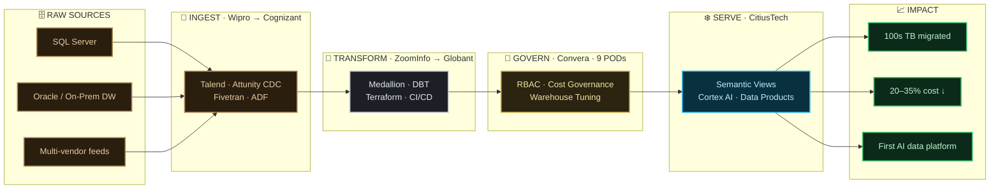
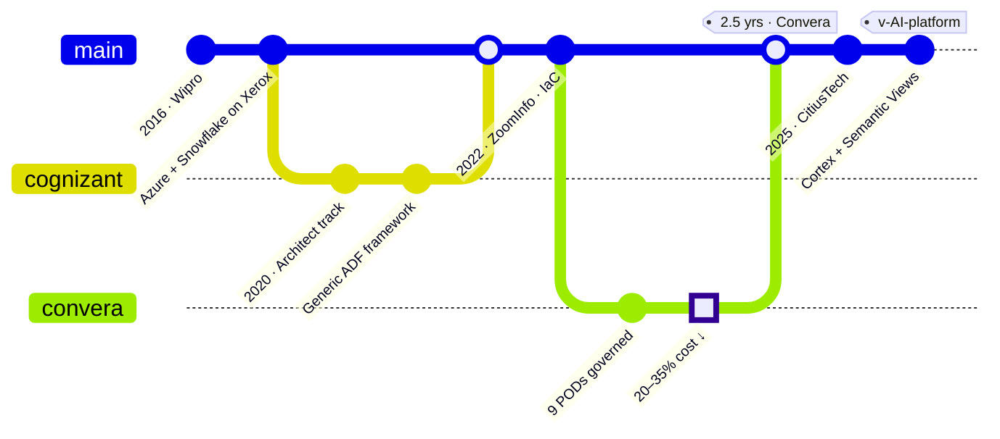

<!-- ══════════════════════════════════════════════════════════════════════════
     Rohan Sasanka Battu · Profile README (robust edition)
     Upload BOTH banner.svg AND this README to the profile repo.
     The banner animates on GitHub; the two mermaid blocks render as diagrams.
     ══════════════════════════════════════════════════════════════════════════ -->

<div align="center">


<br/>


<br/><br/>

[](https://linkedin.com/in/rohan-sasanka-542704215)
[](mailto:rohansasanka3@gmail.com)


</div>

---

<table>
<tr>
<td width="50%" valign="top">

### ⚡ Currently

- 🏗️ Architecting **SQL Server → Snowflake** migrations for US healthcare (Ventra · Sound Physicians)
- 🤖 Building the org's **first AI-powered data platform** — Cortex + Semantic Views
- 🧩 Scaling a **multi-agent delivery framework** for peer-review & data-quality
- 🎯 Certifying: **SnowPro Advanced Architect** · **AWS SA**

</td>
<td width="50%" valign="top">

### 🧠 How I think about data

- **Govern before you scale** — RBAC & cost visibility from day one
- **Medallion, always** — Bronze → Silver → Gold, lineage end-to-end
- **Everything as code** — Terraform, DBT, CI/CD; no click-ops
- **Make it self-serve** — curated data products, not ticket queues

</td>
</tr>
</table>

---

## ⧉ My career, drawn as the architecture I build

> I don't just *use* the Medallion pattern — my whole journey **is** one:
> raw sources on the left, refined through every role, into measurable impact.



---

## ⎇ …and as a commit history



---

## ⌘ `whoami` — as a query

```sql
SELECT  role, focus, currently_shipping
FROM    architects
WHERE   name = 'Rohan Sasanka Battu'
  AND   experience_years >= 10
  AND   platforms @> ARRAY['Snowflake','AWS','Azure'];

-- ┌───────────────────────────┬──────────────────────────────┬──────────────────────────────┐
-- │ role                      │ focus                        │ currently_shipping           │
-- ├───────────────────────────┼──────────────────────────────┼──────────────────────────────┤
-- │ Senior Data & Cloud Arch. │ Migrate · Govern · AI-enable │ Cortex + Semantic Views (AI) │
-- └───────────────────────────┴──────────────────────────────┴──────────────────────────────┘
```

---

## ◈ The stack I build with

<div align="center">

**Platforms**  
  

**Engineer & Model**  
  

**Move & Automate**  
   

**AI-Native**  
 

</div>

---

## ▲ Impact, in numbers

<div align="center">

| `10+ yrs` | `100s TB` | `20–35%` | `15 engineers` | `9 PODs` | `6 yrs` |
|:--:|:--:|:--:|:--:|:--:|:--:|
| architecting | migrated to Snowflake | cloud cost cut | led & mentored | governed E2E | flagship client (Xerox) |

</div>

---

## ◱ Signals from the platform

<div align="center">


</div>

---

<div align="center">

### ❄️ Building something data-heavy? Let's architect it right.

I advise on Snowflake architecture, enterprise cloud migration, cost governance, and AI-driven data engineering.

[](https://linkedin.com/in/rohan-sasanka-542704215)
[](mailto:rohansasanka3@gmail.com)

<sub>Designed as a data platform, because that's what I do. ❄️</sub>

</div>
