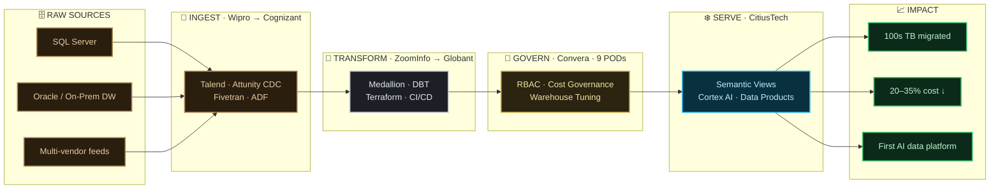

<!-- Custom hero banner — upload banner.png to THIS repo alongside the README -->
<div align="center">


<br/>


<br/><br/>

[](https://linkedin.com/in/rohan-sasanka-542704215)
[](mailto:rohansasanka3@gmail.com)


</div>

<br/>

## ⧉ The architecture of my career

> I don't just *use* the Medallion pattern — my whole journey **is** one.
> Raw sources on the left, refined through every role, into measurable impact.



<br/>

## ⌘ whoami — as a query

```sql
SELECT  role, focus, currently_shipping
FROM    architects
WHERE   name = 'Rohan Sasanka Battu'
  AND   experience_years >= 10
  AND   platforms @> ARRAY['Snowflake','AWS','Azure'];

-- ┌──────────────────────────┬────────────────────────────┬───────────────────────────────┐
-- │ role                     │ focus                      │ currently_shipping            │
-- ├──────────────────────────┼────────────────────────────┼───────────────────────────────┤
-- │ Senior Data & Cloud Arch │ Migrate · Govern · AI-enable│ Cortex + Semantic Views (AI)  │
-- └──────────────────────────┴────────────────────────────┴───────────────────────────────┘
```

<br/>

## ◈ The stack I build with

<div align="center">

**Platforms**  
  

**Engineer & Model**  
  

**Move & Automate**  
   

**AI-Native**  
 

</div>

<br/>

## ▲ Impact, in numbers

<div align="center">

| `10+ yrs` | `100s TB` | `20–35%` | `15 engineers` | `9 PODs` |
|:--:|:--:|:--:|:--:|:--:|
| architecting | migrated to Snowflake | cloud cost cut | led & mentored | governed end-to-end |

</div>

<br/>

## ◱ Signals from the platform

<div align="center">


</div>

<br/>

<div align="center">

### ❄️ Building something data-heavy? Let's talk architecture.

[](https://linkedin.com/in/rohan-sasanka-542704215)
[](mailto:rohansasanka3@gmail.com)

</div>
